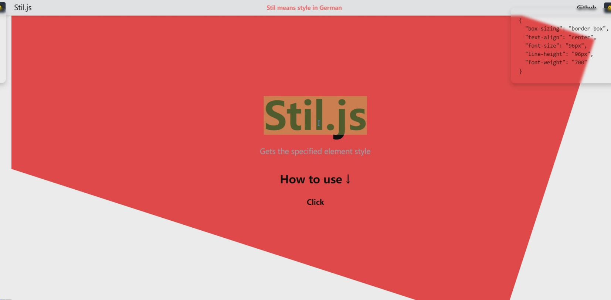
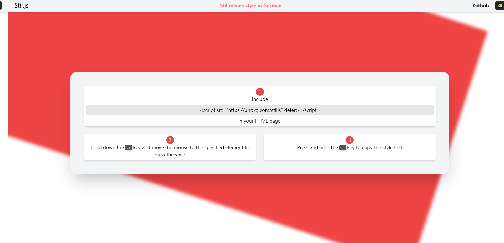

# stiljs

JavaScript gadget, get the style collection of the specified elements of the page, quickly view the style and save development time





## Use stiljs

1. Include stiljs with `<script>` tag in your HTML page:

- UNPKG CDN:

```html
<script src="//unpkg.com/stiljs" defer></script>
```

2. Hold down the <kbd>a</kbd> key and move the mouse to the specified element to view the style

3. Press and hold the <kbd>c</kbd> key to copy the style text

## License

stiljs is [MIT Licensed](LICENSE).